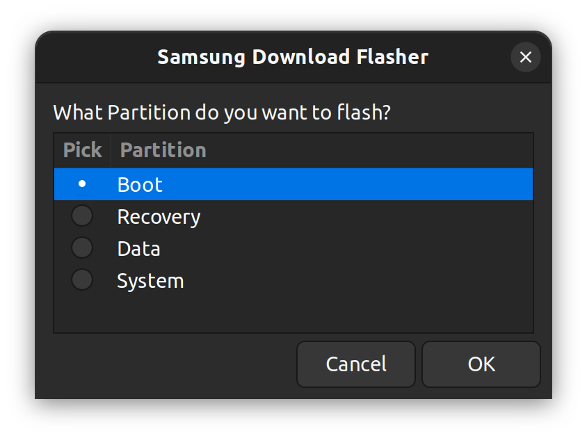
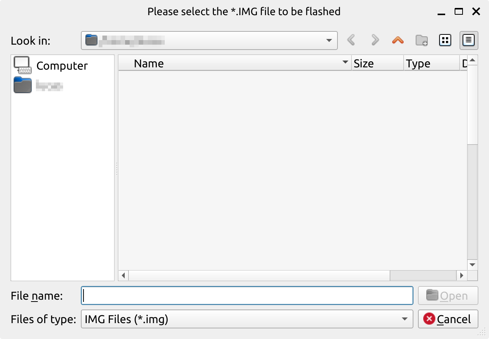
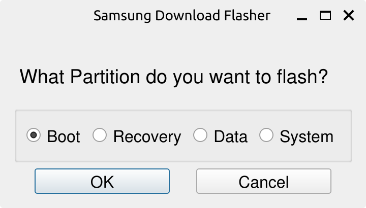

# SamsungFlashGUI
A Python Script that can be used to easily flash .img files to any Samsung phone
### Running
Download the file corresponding to your OS. 

To run on Windows , open a Command Prompt in the directory where it was downloaded and run 
```
SamsungFlashGUI.exe
```
To run on Linux , open a Terminal in the directory where it was downloaded and run 
```
./SamsungFlashGUILinux
```
#### Building
In order to build the Python file into a portable executable , you have to install [Pyinstaller](https://pyinstaller.org/en/stable/) and run the following command:

On Windows 
```
pyinstaller --collect-all customtkinter -w --onefile --noconsole --add-data "%cd%\heimdall:heimdall" SamsungFlashGUI.py 
```
On Linux
```
pyinstaller  --collect-all customtkinter -w --onefile --noconsole --add-data "$(pwd)/heimdall:heimdall" SamsungFlashGUI.py
```
## Features
- Support for Dark mode is being made ( can be beta-tested by using the --dark flag)
- Ability to run on Linux and Windows
- Can be built into a Linux executable or Windows EXE
## Screenshots
 


