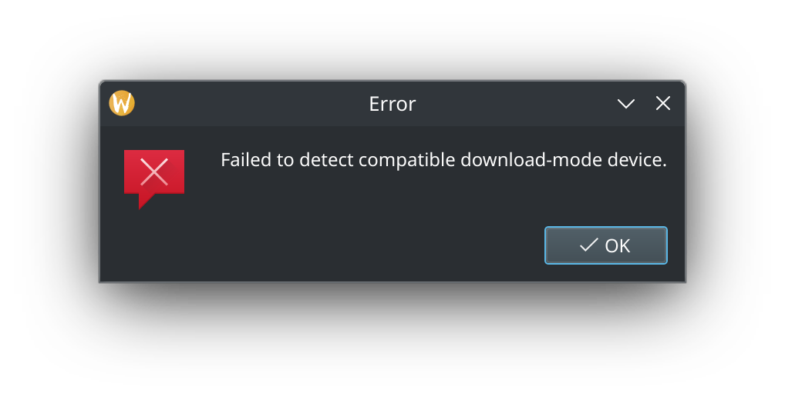
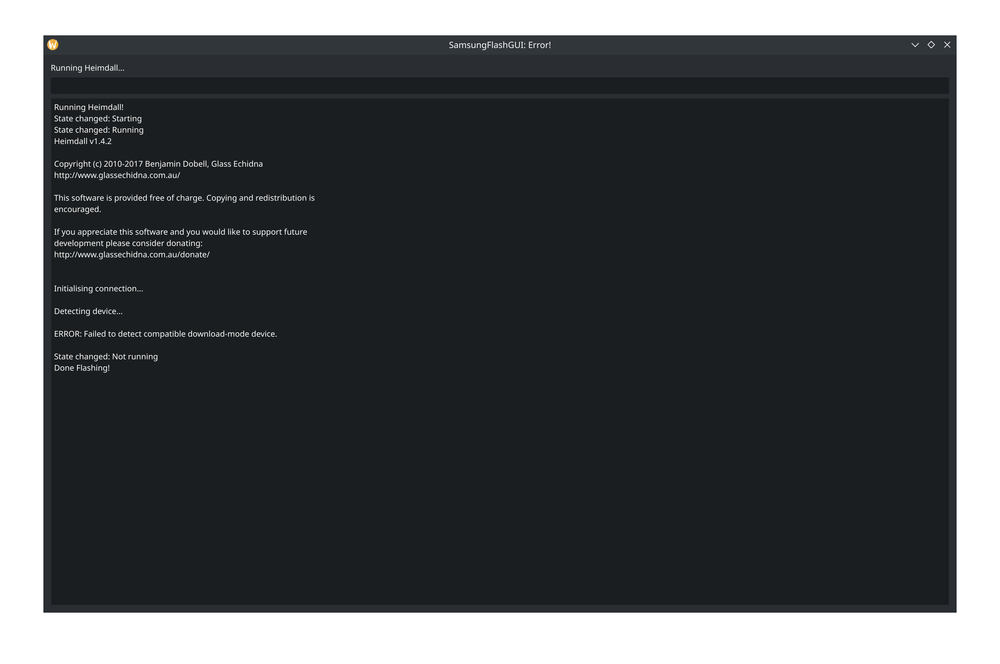

# SamsungFlashGUI
[]()  


A Python Script that can be used to easily flash .img files to any Samsung phone. 

`gui.py` is the main file , and `guiunstable.py` is a updated but unstable version.

See this [Github Project Page](https://github.com/users/justaCasualCoder/projects/1/views/1) for future goals.
# Linux
### Running

Install requirments!

```bash
pip install -r requirements.txt
```

Install Heimdall (Example on Debian):

```bash
sudo apt install heimdall
```

Download / save `gui.py` (or `guiunstable.py`) and run it. 

## Build (Linux)
- Install dependencies:
```bash
python -m pip install --upgrade pip
pip install -r requirements.txt
```
- Install Heimdall (Example on Debian):

```bash
sudo apt install heimdall
```
- Build executable:
```bash
pyinstaller --onefile --noconsole --add-binary "/bin/heimdall:." --add-data "$(pwd)/python-logo-only.svg:." gui.py
```

# Windows
When I first made this, it only worked on Linux. I am now starting to add Windows 10/11 support as well. If you try running the program on Windows, it expects that you have extracted `heimdall` into `heimdall/`. You can follow `heimdall/README.txt` for installing drivers. Here is a snippet:

Driver Installation Instructions:

1. Put your device into download mode and plug it in.

2. Run `zadig.exe` included in the Drivers subdirectory.

3. From the menu chose Options -> List All Devices.

4. From the USB Device list pick "Samsung USB Composite Device".

5. Press "Install Driver", click "Yes" to the prompt and if you receive
       a message about being unable to verify the publisher of the driver.
       Click "Install this driver software anyway".

6. Done
## Build (Windows)
- Download & Extract Heimdall:
```powershell
Invoke-WebRequest https://bitbucket.org/benjamin_dobell/heimdall/downloads/heimdall-suite-1.4.0-win32.zip -OutFile heimdall.zip
expand-archive -path heimdall.zip -DestinationPath heimdall
Move-Item -Path  "heimdall/Heimdall Suite/" -Destination heimdall-tmp
rmdir -r heimdall
mv heimdall-tmp heimdall
rm heimdall/Qt*
```
- Install dependencies:
```powershell
python -m pip install --upgrade pip
pip install -r requirements.txt
```
- Build:
```powershell
pyinstaller --add-data ./heimdall:heimdall --add-data "./devices.json:." --add-data "./python-logo-only.svg:." --onefile -w guiunstable.py
```
# Credits

The following programs were used in the code:

[Heimdall](https://github.com/Benjamin-Dobell/Heimdall) (Used to Flash Images)

[Pyside6](https://doc.qt.io/qtforpython-6/quickstart.html) (Used for the GUI)

[Python](https://www.python.org/) (What it is coded in)

# Screenshots






# Why?

- I wanted a easy way to flash `*IMG`'s to Samsung devices

- The already made Heimdall-Frontend is awesome , but was overcomplicated for me.

- WHY NOT
