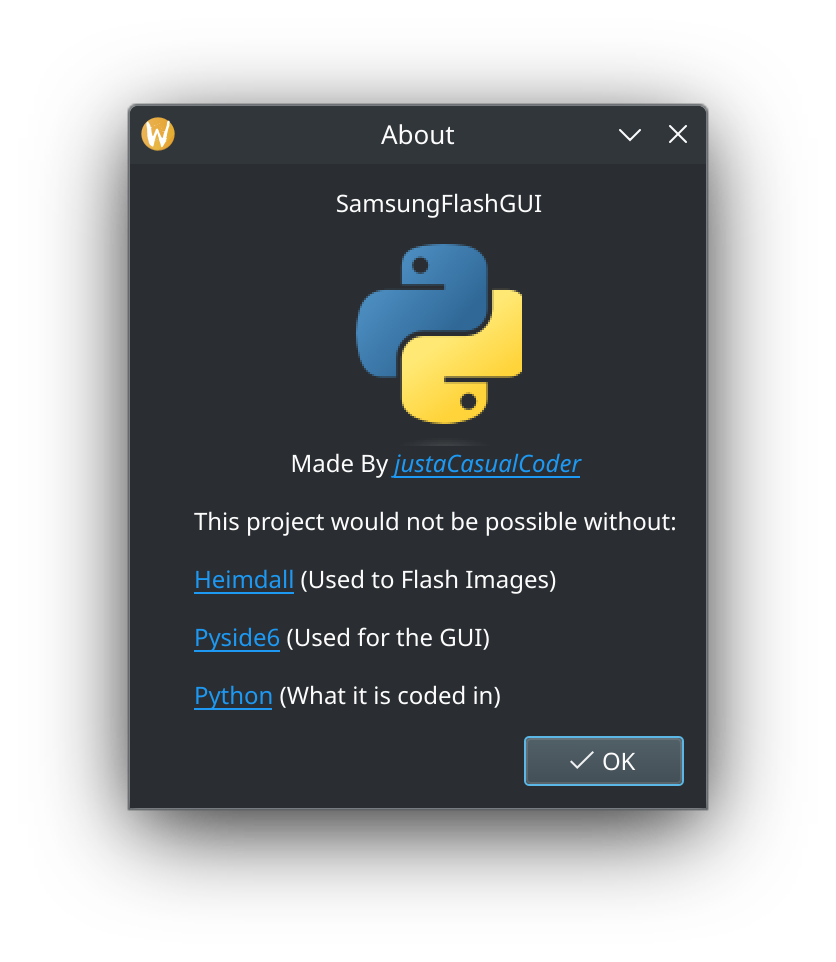

# SamsungFlashGUI

A Python Script that can be used to easily flash .img files to any Samsung phone. 

`gui.py` is the main file , and `guiunstable.py` is a updated but unstable version.

See this [Github Project Page](https://github.com/users/justaCasualCoder/projects/1/views/1) for future goals.
### Running

Install PySide6

```bash
pip install PySide6
```

Install Heimdall (Example on Debian):

```bash
sudo apt install heimdall
```

Download / save `gui.py` and run it. 

#### Building

In order to build the Python file into a portable executable , you have to install [Pyinstaller](https://pyinstaller.org/en/stable/) and run the following command:

```bash
pyinstaller --onefile --noconsole --add-binary "/bin/heimdall:." --add-data "$(pwd)/python-logo-only.svg:." gui.py
```

# Credits

The following programs were used in the code:

[Heimdall](https://github.com/Benjamin-Dobell/Heimdall) (Used to Flash Images)

[Pyside6](https://doc.qt.io/qtforpython-6/quickstart.html) (Used for the GUI)

[Python](https://www.python.org/) (What it is coded in)

# Screenshots




# Why?

- I wanted a easy way to flash `*IMG`'s to Samsung devices

- The already made Heimdall-Frontend is awesome , but was overcomplicated for me.

- WHY NOT
